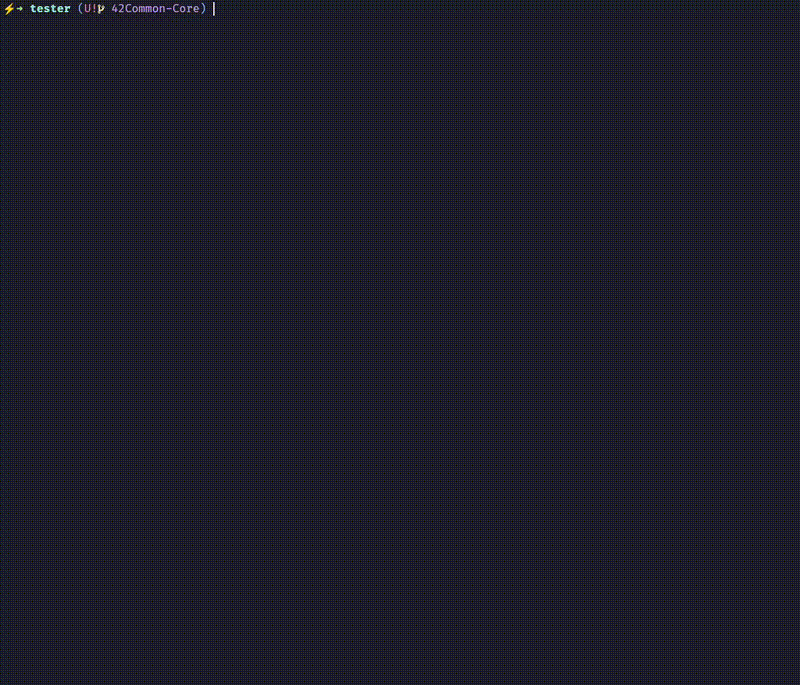

<p align="center">
  
  
  
  
  
  
</p>

<h1 align="center">MiniShell</h1>
<p align="center">A strict-norm Bash replica with predictable tooling for 42 evaluations.</p>

1. [At a Glance](#at-a-glance)
2. [About](#about)
3. [Subject Compliance](#subject-compliance)
4. [Custom Tester](#custom-tester)
5. [Repository Layout](#repository-layout)
6. [Build & Integration](#build--integration)
7. [Usage Guidelines](#usage-guidelines)
8. [Feature Deep Dive](#feature-deep-dive)
9. [Input & Prompt Flow](#input--prompt-flow)
10. [Rendering & UX](#rendering--ux)
11. [Internal Architecture](#internal-architecture)
12. [Tester Workflow](#tester-workflow)
13. [Results & Reporting](#results--reporting)
14. [Credits & Collaboration](#credits--collaboration)

## At a Glance
> **Highlights:** What evaluators can expect in the first five minutes.
- Executes POSIX commands with pipes, redirects, and heredocs while mirroring Bash exit codes through the single global `g_exit`.
- Builtins (`echo`, `cd`, `pwd`, `export`, `unset`, `env`, `exit`) run in-place or in child processes depending on pipeline context.
- Parser defends against malformed syntax early, matching Minishell subject edge-cases (`|`, dangling redirects, empty tokens).
- Custom tester automates Bash parity and Valgrind sweeps so every defense starts with a reproducible baseline.
- Co-built by Paula Alexandra (`paalexan`) and João Pedro (`jopedro-`) with clear ownership per subsystem so knowledge transfers quickly at evaluation time.

## About
> **Highlights:** Why this shell feels reliable in daily use.
- Interactive loop ties `readline`, prompt generation, and signal choreography so `Ctrl-C` interrupts safely without tearing down state.
- Tokenization and expansion are staged: splitting respects quotes, then `$` expansion and heredoc rules decide how much Bash-like magic to apply.
- Execution reuses one command graph (`t_cmd` list) for both pipelines and single commands, cutting duplicated logic across forks.

<details>
  <summary>Subsystem responsibilities</summary>
  <ul>
    <li><code>src/parser/</code> cleans input, expands environment variables, and tags tokens.</li>
    <li><code>src/execution/</code> wires pipes, coordinates forks, and applies redirections.</li>
    <li><code>src/redirection/</code> centralizes permission checks and heredoc lifecycle management.</li>
  </ul>
</details>

## Subject Compliance
> **Highlights:** Direct trace between subject rules and implementation.
- Mandatory builtins live under `src/builtins/` and respect subject constraints (`cmd_exit` enforces numeric-only arguments, `cmd_cd` updates `PWD`/`OLDPWD`).
- Signal handling matches expectations: `ctrl_c_handler` refreshes the prompt, heredoc forks switch to `heredoc_sigint_handler`, and child processes restore default behavior.
- Only one global is present (`g_exit`), and every heap allocation flows through dedicated cleanup helpers (`free_cmd`, `free_minishell`, `free_env_array`).
- `readline` is the sole external dependency; leaks from it are waived while project-owned allocations are released (see `clean_all`).
- `needs_pipe_continuation` mirrors Bash multiline behavior, satisfying the “incomplete pipe” clause from the subject PDF.

<details>
  <summary>Compliance checklist</summary>
  <ul>
    <li>Redirections: input/output/append/heredoc support via <code>process_redirect</code> and <code>apply_single_redirect</code>.</li>
    <li>Environment editing: <code>set_var</code>, <code>env_add_var</code>, and <code>del_var</code> cover export and unset flows.</li>
    <li>Error messaging: dedicated helpers mimic Bash wording (`print_syntax_error`, `handle_cmd_error`).</li>
  </ul>
</details>

## Custom Tester
> **Highlights:** One command to prove parity with Bash.
- `tester/Makefile` orchestrates runs against `test_cases_auto.txt`, stores Bash and Minishell outputs, and produces human-friendly diffs.
- Shell scripts (`run_minishell.sh`, `run_bash.sh`) normalise prompts, colours, and SHLVL so comparisons stay meaningful across machines.
- `run_valgrind.sh` applies readline suppressions automatically, marking tests green only when leak summaries are clean.
- Full walkthroughs, edge-case notes, and extension tips live in the [tester README](tester/README.md).

```sh
cd tester
make              # run automated suite and generate diff_summary.txt
make valgrind     # optional leak run across the same command list
```

<p align="center">
  
</p>

<details>
  <summary>Tester pipeline internals</summary>
  <ul>
    <li>Outputs land in <code>tester/results/{minishell,bash,diff}</code> with <code>__CMD_START__/__CMD_END__</code> markers for parsing.</li>
    <li><code>generate_summary_diff.py</code> correlates failing diffs with the originating command for quick triage.</li>
    <li>Manual scenarios live in <code>tester/test_cases_manual.txt</code>; copy lines into the suite when you confirm behaviour.</li>
  </ul>
</details>

## Repository Layout
> **Highlights:** Navigate modules without grepping.
- `src/` – project code organised by responsibility (parser, tokenizer, execution, builtins, env, redirection, signals, cleanup, error).
- `libft/` – cloned automatically when `make` runs; exposes string helpers, list utilities, and `get_next_line`.
- `tester/` – parity and leak harness, including reusable scripts and sample files.
- `subject_minishell.pdf` – original requirements for cross-referencing during peer reviews.

<details>
  <summary>Directory cheat sheet</summary>
  <table>
    <tr><th>Directory</th><th>Purpose</th></tr>
    <tr><td><code>src/execution/</code></td><td>Pipelines, forks, builtin routing, wait loops.</td></tr>
    <tr><td><code>src/redirection/</code></td><td>Redirect parsing, permission checks, heredoc tempfiles.</td></tr>
    <tr><td><code>src/cleanup/</code></td><td>Memory hygiene and descriptor sweeping before exit.</td></tr>
    <tr><td><code>tester/test_files/</code></td><td>Fixtures (empty, large, permission-locked) for edge cases.</td></tr>
  </table>
</details>

## Build & Integration
> **Highlights:** Rebuild, relaunch, and lint with two targets.
- `make` clones `libft` if missing, compiles objects into `.obj/`, and links with `-lreadline`.
- `make valgrind` spins up an interactive session with the pre-generated suppression file, matching tester behaviour.
- `make clean` and `make fclean` sweep objects, binary, suppression file, and even `libft/` so you can benchmark fresh checkouts.

```sh
sudo apt install libreadline-dev  # If not installed already
make                              # build minishell (libft fetched if absent)
make re                           # full rebuild
make norm                         # run norminette with coloured status output
```

## Usage Guidelines
> **Highlights:** How to interact like a real user would.
- Launch `./minishell`, type commands exactly as in Bash, and exit with `Ctrl-D` or the builtin `exit`.
- Builtins mutate the active environment when they run in the parent (single command) or mutate a fork-local copy inside pipelines.
- Error codes mirror Bash: missing command returns `127`, permission issues return `126`, and signal exits follow `128 + signal`.

```sh
./minishell
minishell> export FILES="src parser"
minishell> echo "$FILES" | tr ' ' '\n'
minishell> cat <<EOT | grep minishell
prompt
minishell loop
EOT
minishell> exit
```

<details>
  <summary>Everyday tips</summary>
  <ul>
    <li>Use <code>needs_pipe_continuation</code> behaviour: ending a line with <code>|</code> keeps the prompt open for the continuation.</li>
    <li>Heredoc delimiters honour quotes: quoted delimiters disable expansion, unquoted pass through <code>handle_expansion</code>.</li>
    <li>Unset <code>PATH</code> to test fallback error paths (`minishell: command not found`).</li>
  </ul>
</details>

## Feature Deep Dive
> **Highlights:** From raw input to child processes.

| Stage | Key files | Notes |
| ----- | --------- | ----- |
| Tokenization | `src/tokenizer/tokenizer_split.c`, `tokenizer_utils.c` | `split_input`, `get_next_segment`, and `unescape_token` turn raw lines into typed `t_token` nodes ready for expansion. |
| Expansion | `src/parser/parser_expansion.c`, `tokenizer_lst.c` | `expand_token`, `handle_all`, and `handle_dollar` apply env lookups while preserving quote flags for later decisions. |
| Command graph | `src/builtins/builtins_utils.c`, `execution/exec_cmd.c` | `build_cmd_list`, `process_token`, and `cmd_from_tokens` consolidate tokens into `t_cmd` nodes with redirect chains. |
| Execution | `src/execution/exec_pipes.c`, `exec_child.c` | `exec_pipeline`, `run_single_cmd`, and `exec_child` coordinate pipes, builtins, forks, and exit propagation. |
| Cleanup | `src/cleanup/cleanup_cmd.c`, `cleanup_utils.c` | `clean_all`, `free_cmd`, and `free_hc_minishell` release argv, env copies, and heredoc tmpfiles to finish cleanly. |

- Control keeps looping through `main` → `loop` until EOF; each iteration builds tokens, compiles commands, feeds them to `exec_pipeline`, and updates `g_exit` for the next prompt.
- Redirection helpers (`process_redirect`, `setup_redirections`, `apply_single_redirect`) sit between parsing and execution so every child inherits pre-vetted descriptors.

<details>
  <summary>Redirection specifics</summary>
  <ul>
    <li><code>check_output_permission</code> inspects parent directories so messages stay informative even before a file exists.</li>
    <li><code>write_heredoc_to_tmp</code> creates <code>/tmp/.minishell_heredoc_*</code> files and tracks them for removal in <code>free_heredoc_tmpfiles</code>.</li>
    <li><code>apply_single_redirect</code> centralises <code>dup2</code> and marks failures for later error printing.</li>
  </ul>
</details>

<details>
  <summary>Environment lifecycle</summary>
  <ul>
    <li>`copy_env_array` and `init_env` duplicate the inherited environment so mutating builtins never touch the parent process env.</li>
    <li>`export_assign` handles both direct replacement and `+=` concatenation (`export VAR+=suffix`).</li>
    <li>`cmd_unset` rebuilds the env array minus the target key, ensuring no dangling strings remain.</li>
  </ul>
</details>

## Input & Prompt Flow
> **Highlights:** Keeping the REPL responsive.
- `build_prompt` composes `user@hostname:cwd$` using cached env data (`sh->home`, `sh->user`) and collapses `$HOME` to `~` for readability.
- Before each `readline`, `set_interactive_signals` arms `SIGINT` and `SIGQUIT`; after reading, handlers flip to child-friendly defaults.
- `handle_input_line` stores tokens on the shell struct, runs syntax guards, executes, and frees everything before the next loop.

<details>
  <summary>Continuation & history logic</summary>
  <ul>
    <li>Empty lines are ignored; non-empty lines hit `add_history` so testers can arrow through commands like Bash.</li>
    <li>When heredocs are detected, the shell flags `is_heredoc` to disable further expansions inside delimiters.</li>
    <li>Pipe continuations stay open because `needs_pipe_continuation` trims trailing whitespace before checking for `|`.</li>
  </ul>
</details>

## Rendering & UX
> **Highlights:** Output designed for evaluators reading diffs.
- Error printers prefix with `minishell:` and reuse Bash wording, ensuring the tester diff is only triggered by behavioural differences.
- Redirect failures are deferred until after execution so the parent can report them once per pipeline (`print_redirect_error`).
- `prompt_utils.c` trims hostname newlines and handles empty `PWD` gracefully to keep the interface tidy on remote hosts.

<details>
  <summary>Message helpers</summary>
  <ul>
    <li><code>print_syntax_error</code> and <code>print_syntax_error_eof</code> centralise subject messaging for malformed inputs.</li>
    <li><code>handle_cd_error</code> differentiates between invalid options, missing HOME, and `chdir` failures.</li>
    <li><code>exec_invalid_cmd</code> ensures blank commands return `127` without leaking file descriptors.</li>
  </ul>
</details>

## Internal Architecture
> **Highlights:** Data structures and lifetime management.
- `t_msh` (singleton returned by `get_shell`) caches env copies, prompt metadata, heredoc bookkeeping, and the running command list.
- `t_cmd` nodes form a doubly linked list with argv arrays, redirect chains, builtin flags, and cached open file descriptors.
- `t_token` keeps raw/expanded strings plus metadata (`quoted`, `expanded_empty`) so later stages can decide how to treat empty strings.
- `t_redirect` captures redirect type and target path, chained per command for sequential application.

<details>
  <summary>Global state discipline</summary>
  <ul>
    <li>`g_exit` is updated on every command; builtins and child processes set it before returning or exiting.</li>
    <li>`free_final_minishell` and `free_hc_minishell` variants tailor cleanup for graceful exits versus heredoc aborts.</li>
    <li>`clean_fds` closes descriptors from `3` onward before exiting to avoid stray handles between tests.</li>
  </ul>
</details>

## Tester Workflow
> **Highlights:** How to run, inspect, and iterate quickly.
- `make -C tester` wipes previous results, executes the auto list, and prints OK/KO per command with orange indexes.
- Review mismatches in `tester/results/diff/test*.diff` or open `diff_summary.txt` for side-by-side comparisons.
- Extend coverage by appending commands to `tester/test_cases_auto.txt`; scripts automatically renumber outputs.

```sh
make -C tester clean   # optional: nuke previous run without touching binaries
make -C tester run     # alias: only regenerate minishell/bash outputs
```

<details>
  <summary>Manual scenarios</summary>
  <ul>
    <li>Lines under "To be Fixed" in `test_cases_manual.txt` capture behaviours observed during development.</li>
    <li>Use the included fixtures (`big_file`, `invalid_permission`) to check performance and error reporting.</li>
    <li>Valgrind logs store per-command traces in `tester/results/valgrind_logs/` for deep dives.</li>
  </ul>
</details>

## Results & Reporting
> **Highlights:** Actionable, low-noise logs.
- The tester prefixes every command with markers so Python scripts can slice outputs without guessing prompt lines.
- `diff_summary.txt` lists command numbers, the original input, both outputs, and the diff chunk for fast triage.
- Valgrind runs append `OK`/`KO` lines into `results/valgrind_results.txt` with the offending command when leaks appear.
- Console summaries emphasise counts (`pass/fail/total`) instead of raw diff dumps, keeping defences focused on high-signal issues.

<details>
  <summary>Next steps after a KO</summary>
  <ul>
    <li>Open the matching `testN.diff` and reproduce the command manually inside `./minishell`.</li>
    <li>Use `tester/scripts/run_minishell.sh` directly if you need to tweak sed cleaning or prompts.</li>
    <li>Capture Bash behaviour with `tester/scripts/run_bash.sh` to confirm whether the subject expects the deviation.</li>
  </ul>
</details>

## Credits & Collaboration
> **Highlights:** Two minds, one shell.
- Paulo Alexandre (`paalexan`) drove the parsing, execution, and error-handling layers, making sure every `t_cmd` is battle-tested before it forks.
- João Pedro (`jopedro-`) focused on environment management, cleanup strategy, and user-facing polish, locking down memory hygiene and prompt comfort.
- Pair-programming sessions aligned architecture decisions; we reviewed each module before merging so any 42 evaluation can call on either of us for clarifications.
- Special thanks to our peers who stress-tested the tester farm and uncovered early heredoc quirks.
